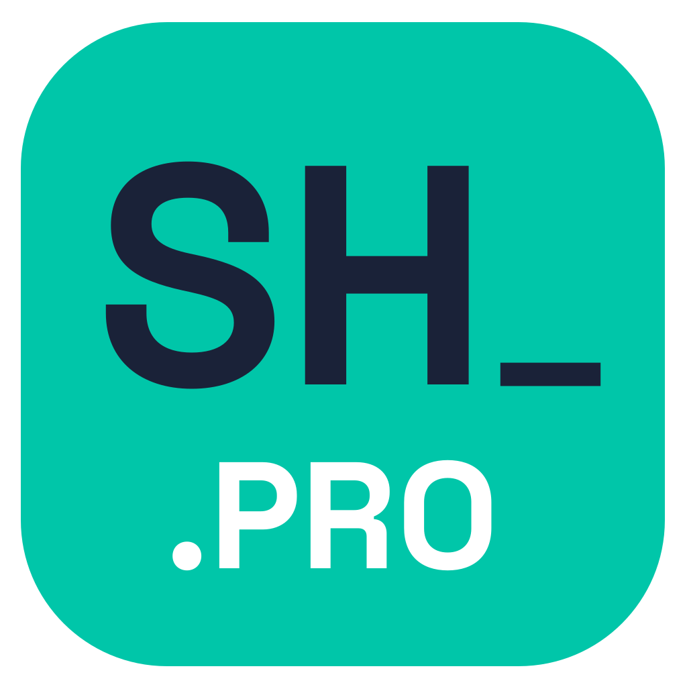
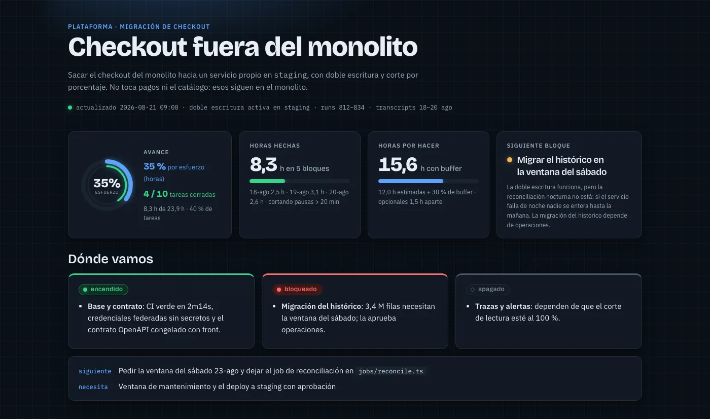
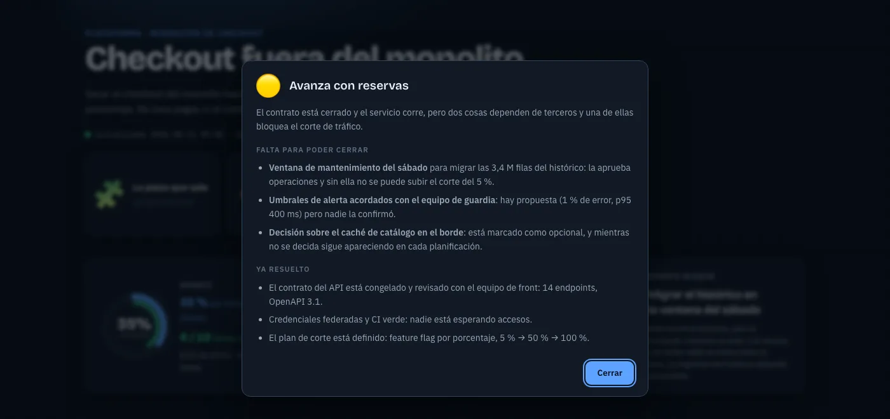
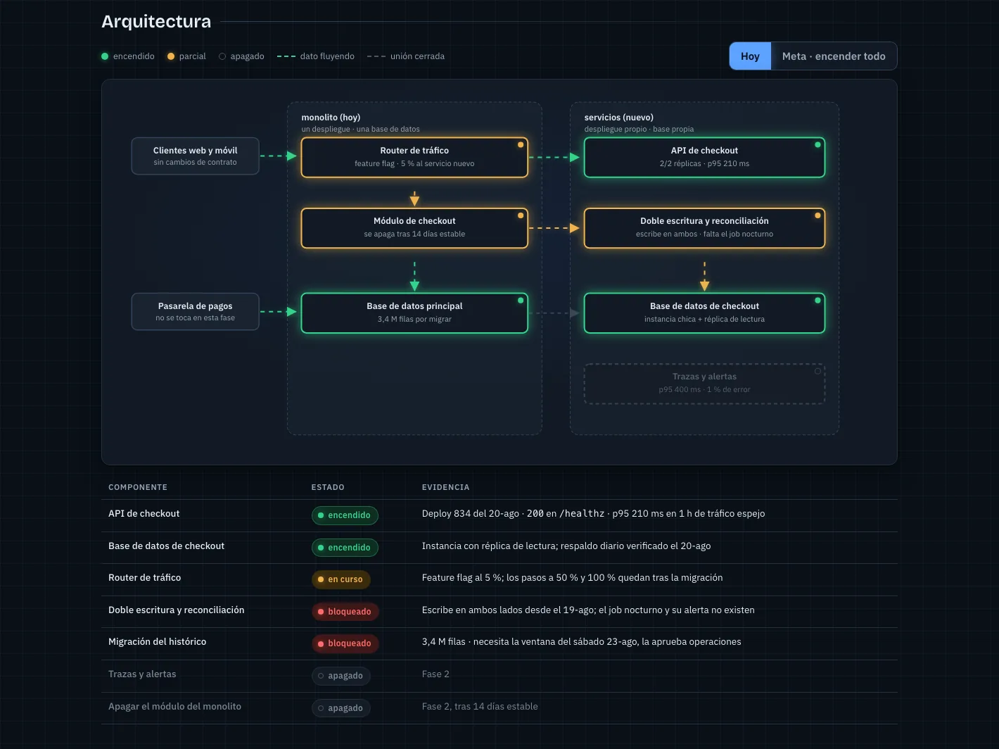
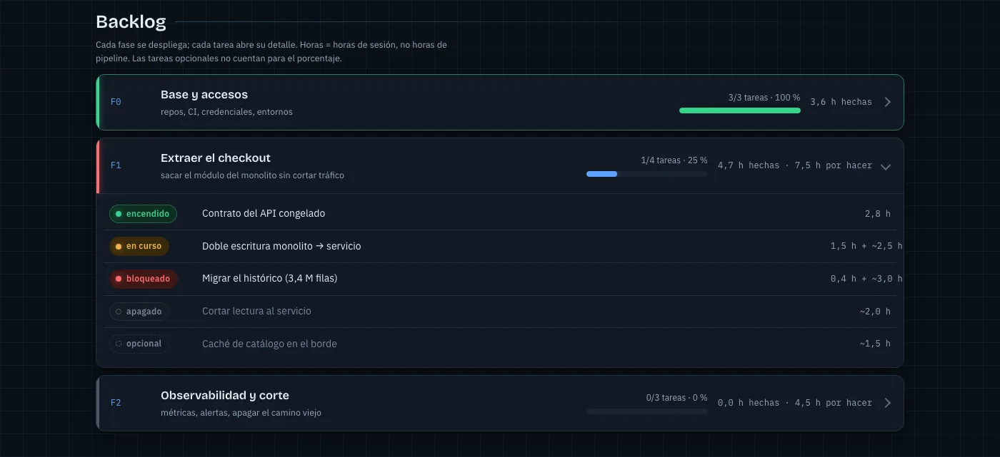
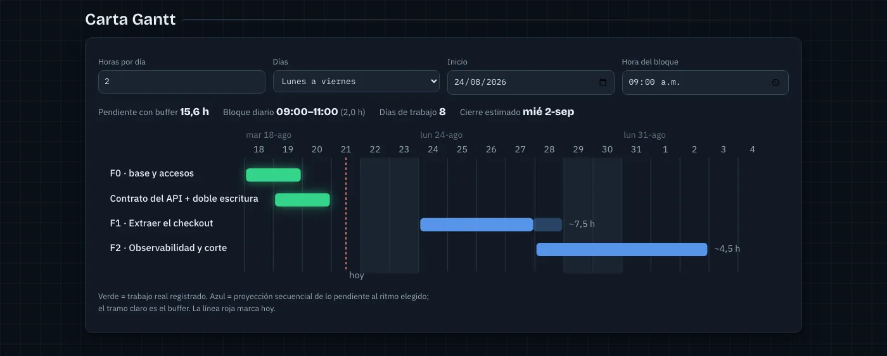
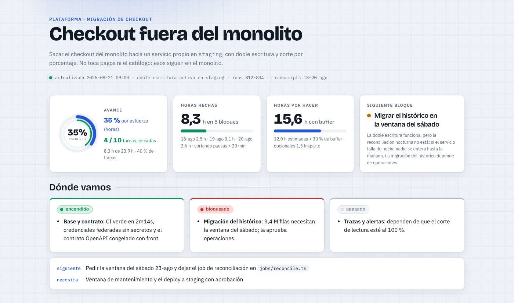
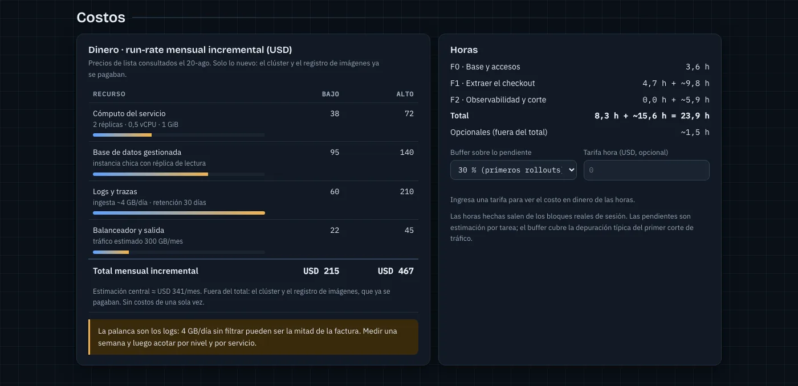

<p align="center">
  
</p>

<h1 align="center">tablero</h1>

<p align="center">
  El formato con el que presento el estado de mis proyectos, empaquetado como skill de Claude Code.<br>
  Un artefacto vivo en vez de un informe muerto.
</p>

<p align="center">
  <a href="LICENSE"></a>
  
  <a href="CHANGELOG.md"></a>
  <a href="https://sergiohidalgo-pro.github.io/tablero/demo/"></a>
</p>

---

## Qué hace

Le pides el estado de un proyecto y publica una página con:

- **Un emblema y un semáforo de contexto**: el emoji del proyecto explica por qué se eligió, y el semáforo dice si se puede avanzar sin depender de nadie — verde solo si lo único que falta son horas.
- **Cuatro medidores**: avance por esfuerzo y por tareas, horas hechas, horas por hacer con buffer, y el foco o bloqueo del momento.
- **Dónde vamos** en tres columnas: encendido · bloqueado · apagado, y la acción concreta que sigue.
- **Un diagrama** donde cada componente está literalmente encendido, parcial o apagado, con paquetes viajando por las conexiones vivas. Cada caja se puede tocar para leer qué es y por qué está así, y un toggle *Meta* enciende todo para mostrar hacia dónde va.
- **Backlog** en fases plegables, con horas hechas y estimadas por tarea.
- **Costos** incrementales, con rango bajo/alto y la palanca que domina la factura.
- **Carta Gantt simulable**: el lector mueve horas por día, días hábiles y fecha de inicio, y ve moverse la fecha de cierre.
- **Ritmo de sesiones**: cuándo se trabajó de verdad, y qué recomienda ese dato.

Todo se calcula desde un único bloque de datos. No hay números escritos a mano en el HTML.

## Cómo se ve

**[Ver la demo en vivo →](https://sergiohidalgo-pro.github.io/tablero/demo/)** — un tablero completo de un proyecto ficticio ("sacar el checkout de un monolito"). Tócalo: el Gantt es un simulador, mueve las horas por día y la fecha de cierre se mueve con ellas.

Las capturas de abajo salen de ahí.



*Arriba: el emblema del proyecto, el semáforo de contexto, los cuatro medidores y las tres columnas de estado. Todo se calcula desde un único bloque de datos.*



*El semáforo no mide avance: mide si se puede seguir sin depender de nadie. Verde es "solo faltan horas"; rojo es "falta que alguien decida". Al tocarlo lista qué falta, con dueño, y qué ya está resuelto. El emoji de al lado explica por qué se eligió ese ícono y no otro.*



*El diagrama no ilustra: informa. Verde encendido con evidencia, ámbar parcial, punteado apagado, y paquetes viajando solo por las conexiones vivas. Toca cualquier caja —o llega con el tabulador y pulsa Enter— y abajo se explica qué es y por qué está en ese estado. El toggle "Meta" enciende todo para mostrar hacia dónde va el proyecto.*



*La fase con trabajo vivo se abre sola y se marca en rojo. Cada tarea declara horas gastadas y horas restantes.*



*Verde lo hecho, azul la proyección, el tramo claro el buffer. Cambia horas por día y la fecha de cierre se mueve.*

<details>
<summary>Tema claro y costos</summary>





</details>

## Por qué existe

Un estado de proyecto suele ser una lista de bullets que envejece el mismo día. Este formato apuesta por lo contrario: cada afirmación lleva su evidencia (id de run, ruta, salida de comando), cada hora es de sesión real y no de reloj de pipeline, y el plan es un simulador — si el ritmo cambia, la fecha cambia a la vista de todos.

Las reglas duras de la skill son casi todas sobre honestidad del dato, no sobre diseño.

## Instalación

**Beta pública.** El formato lleva semanas en uso con proyectos reales; la instalación como plugin y el uso en Cowork están recién estrenados. Si algo falla, [abre un issue](https://github.com/sergiohidalgo-pro/tablero/issues): es exactamente lo que busco en esta etapa.

### Claude Code

Como plugin:

```
/plugin marketplace add sergiohidalgo-pro/tablero
/plugin install tablero@tablero
```

O solo la skill:

```bash
git clone https://github.com/sergiohidalgo-pro/tablero.git
ln -s "$PWD/tablero/skills/tablero" ~/.claude/skills/tablero
```

### Claude Cowork

Como plugin: **Customize → Plugins → Add marketplace**, pega `sergiohidalgo-pro/tablero` e instala `tablero`.

Como skill suelta: comprime la carpeta `skills/tablero` en un ZIP (la carpeta va en la raíz del ZIP) y súbela en **Customize → Skills → Create skill → Upload**.

En Cowork no existe la herramienta de artefactos de Claude Code, así que el resultado es siempre el archivo HTML local. `publicar` no aplica ahí.

## Uso

```
/tablero              # genera el HTML local y te dice la ruta
/tablero publicar     # además lo publica como artefacto
/tablero <url>        # actualiza un tablero ya publicado, sobre la misma URL
```

O simplemente pídelo: *"hazme el tablero de este proyecto"*, *"¿dónde vamos con la migración?"*.

Por defecto **no publica nada**: deja un archivo autocontenido que abres en el navegador. Publicar es una acción hacia afuera y se pide. Al actualizar, republica sobre la misma URL en vez de crear una segunda.

## Personalizar

| Qué | Dónde |
|---|---|
| Logo y créditos del footer | `skills/tablero/assets/logo.svg` y el bloque `.brand` del template |
| Paleta, tipografía, movimiento | CSS de `skills/tablero/assets/template.html` |
| Qué secciones aparecen | `skills/tablero/references/sections.md` |
| Forma de los datos y fórmulas | `skills/tablero/references/data-contract.md` |

El logo va inline en el footer del template, sin `<style>` interno (las clases de un SVG embebido se filtran al CSS de la página). Si lo reemplazas: viewBox cuadrado, colores como atributos `fill`, y un fondo propio para que funcione en tema claro y oscuro.

Si haces un fork con tu propia identidad: cambia el logo y la línea de crédito, y deja el enlace a este repo. Es lo único que pido.

## Estructura

```
skills/tablero/
├── SKILL.md                    # contrato de activación y reglas duras
├── assets/
│   ├── template.html           # el formato: CSS, estructura y motor de render
│   ├── local-wrapper.html      # envoltorio html/head/body para el archivo local
│   └── logo.svg                # marca del footer
└── references/
    ├── data-contract.md        # forma de los datos y métricas derivadas
    ├── sections.md             # catálogo de secciones y reglas del diagrama
    └── design-system.md        # tokens, componentes, movimiento, accesibilidad
```

## Créditos

Formato y skill: **[Sergio Hidalgo](https://github.com/sergiohidalgo-pro)**.
Construido con [Claude Code](https://claude.com/claude-code).

MIT — úsalo, fórkealo, hazlo tuyo.
